# segurtasun-industriala

## kontzeptuak

- https://en.wikipedia.org/wiki/Modbus
- http://www.modbus.org
- https://en.wikipedia.org/wiki/SCADA

 > a single-bit physical output is called a coil, and a single-bit physical input is called a discrete input or a contact
 

## 1. Fasea: Fabrika sortu

Industria bateko fabrika simulatuko da. Bere PLC, HMI, sensore (tenperatura, ...), aktuadore (argi-led, pultsadore). Adibidez, PLC batek piezak egiten dituen makina bat kontrolatuko du, geldirik dagoenean argi gorri bat piztuko du, lanean dagoenean argi berdea eta pieza amaitzen duenean seinale bat (beste argi bat izan daiteke, edo buzz bat, ...). Beste PLC batek tenperatura eta humedadea kontrolatuko ditu (slave device: nodemcu bat izan daiteke). HMIak egongo dira prozesu guztiaren egoera azaltzeko (argien egoera, tenperatura, ) eta baita ere makinak gelditzeko eta hasieratzeko. Beste PLC batek piezak egiteko lehengaien egoera kontrolatuko du, zenbat dauden. Kamarak, RFID irakurgailuak, BLE Bluetooth Low Energy device, Alexa(https://developer.amazon.com/es/docs/alexa-voice-service/set-up-raspberry-pi.html), echo(https://www.makeuseof.com/tag/diy-google-home-assistant-raspberry-pi/)... ere integratu daitezke. Fabrikak sosrtzen dituen datuak gordeko dira ondoren analizatu ahal izateko eta hauetatik AI erabiliz ikasteko. Aukera dado ere informazio hauek Cloud-ean gordetzeko (MQTT erabiliz datuak mugituz).

Gure fabrikari (Smart Factory), WIFI sarea ere gehituko diogu. Baita ERP bat. VNC aukera ere kanpotik operadoreak konponketak egiteko. HMI-a VNC bidez kontrolatzeko aukera (remote HMI access). Kanpo operadoreak OT sarera konektatzeko VPN (https://www.wireguard.com/ openvpn ordez!!) erabili daiteke.

Lehenengo fase honetan segurtasuna kontutan hartu gabeko diseinua egingo da. Erabilgarritasunari begira aukerak gehituko dira. 

Erabiliko dugun HW: 
- PLCak egiteko Siemens s7-1200(x2) eta Raspberry Pi (OpenPLC erabiliz simulatuz)
- HMIak egiteko Siemens(x2) eta HMI simulatzaileak. 
- "makinak", arduino edo raspberry pi-ekin simulatuko dira. 
- Sensore eta aktuadoreak
- Cloud

### Open PLC

- PLC
- HMI
- https://www.openplcproject.com/reference
- https://openplc.discussion.community/post/my-first-project-9671952

PLC eta HMI bat simulatu https://www.openplcproject.com. Raspberry Pi, Arduino, nodemcu, Linux,... erabiliz egin daiteke. 

#### Programa sinple bat egin: Led bat piztu/itzali.

##### 1 - getting-started-rpi:

- https://www.openplcproject.com/getting-started-rpi

- Raspbian Buster Lite instalatu. IP static eman eman (https://raspberrypi.stackexchange.com/questions/37920/how-do-i-set-up-networking-wifi-static-ip-address, https://wiki.debian.org/NetworkConfiguration) eta ssh bidez konektatu ``` $sudo raspi-conf``` erabiliz. Hemendik aurrera gure PLCak sare konexioa eta argindarra bakarrik izango ditu eta ssh bidez konektatuko gara. ```$ssh pi@IP```

##### 2 - PLC programa egin:

https://www.openplcproject.com/plcopen-editor

https://www.element14.com/community/community/applications/industrial-automation-space/blog/2019/08/09/trying-out-openplc-on-a-raspberry-pi

**Hello World:**

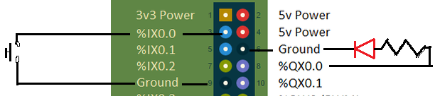
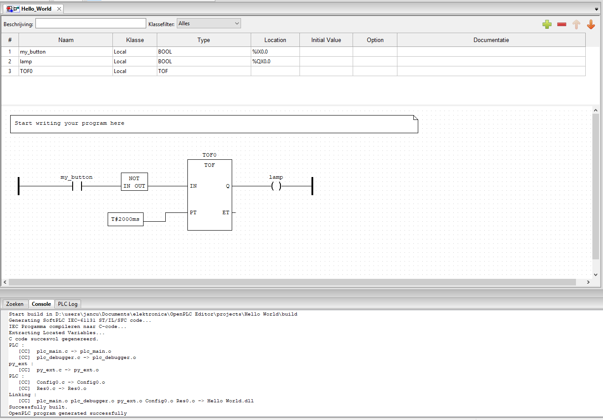

**Hello World (Sarrera %X0.2 erabiliz. Kontuz! zirkuitua aurrekoaren ezberdinba da!!):**

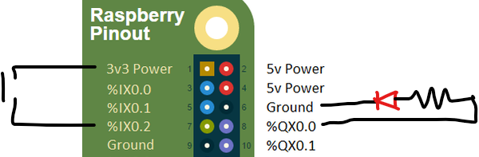
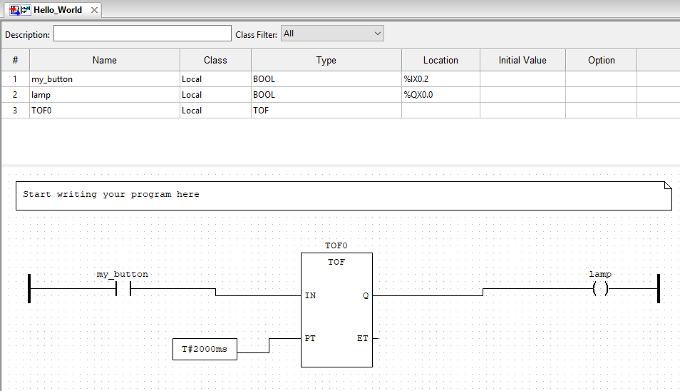

**led piztu**

led-piztu-zirkuitoa             |  led-piztu-eskema
:-------------------------:|:-------------------------:
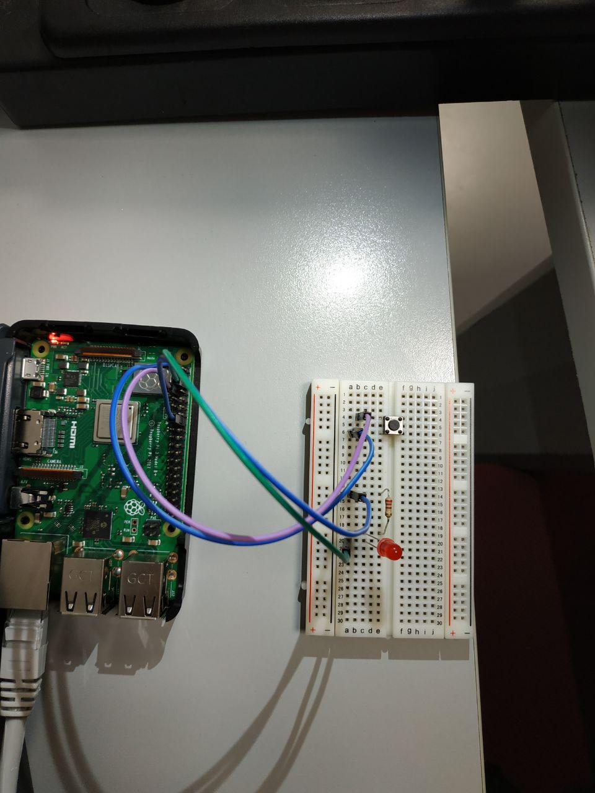  |  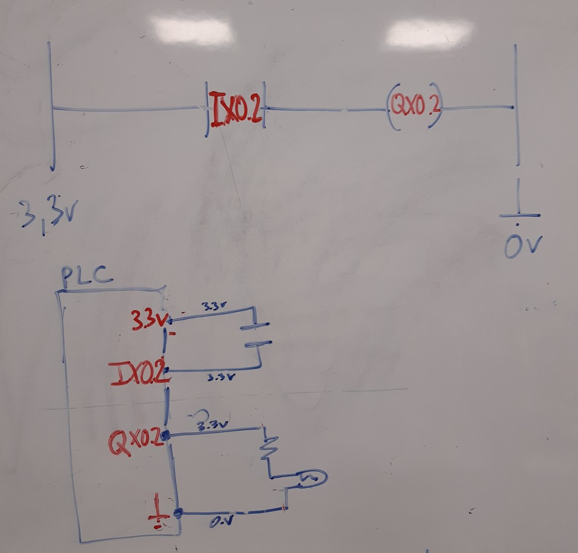


##### 3 - HMI bat simulatu:
TIA Portal (ikusi beherago) erabiliz edo Beste aukerak:

https://www.openplcproject.com/reference-installing-scadabr


#### Programa konplexuagoak egin


1 - Bi botoi. Batek piztu besteak itzaldu.

2 - Botoi berdinarekin, itzaldu eta piztu

#### PLC simulatuak sare batean konektatu eta elkarrekintza

PLC batetik beste PLC bat kontrolatu (nola? modbus?) 'slave device' MTU, IP, Software(linux, windows), 

- https://www.openplcproject.com/getting-started-modbus-io
- https://www.openplcproject.com/getting-started-esp8266

##### Beste OpenPLC bat instalatu


port number aldatu (makina berdinean bat baino gehiago instalatu behar badira)
```
Edit /webserver/ webserver.py line 2213 and change

app.run(debug=False, host='0.0.0.0', threaded=True, port=8080)

to

app.run(debug=False, host='0.0.0.0', threaded=True, port=[whatever-port-you'd-like])
```

### Siemens

- S7-1200 PLC. CPU 1212C AC/DC/Rly 6ES7 212-1HE40-0XB0 v4.2
- HMI

Ariketak:
 * Siemens S7-1200 PLCa eta HMI instalatu eta konfiguratu. Argia itzali/Piztu aplikazioa egin.
 * Siemens PLC (24V) eta Raspberry Pi-Arduino (5V): Gailuen arteko lotura. Nola pasa batetik bestera seinaleak.
 
#### TIA Portal

* New Project
* Add new device (S7-1200 PLC. CPU 1212C AC/DC/Rly 6ES7 212-1HE40-0XB0 v4.2)
* (PLC_1) Device configuration -> PROFINET interface -> Ethernet addresses -> (add new subnet) PN/IE_1; (IP Protocol) ip/mask
* (PLC_1) Device configuration -> Protection & Security -> (connection mechanisms) Permit access with PUT/GET ? (aztertu)
* (menu) online -> simulation -> start

TIA-PORTAL proiektu bat egina adibide moduan: [files/tia-portal-project.rar](files/tia-portal-project.rar)

#### S7. Profinet
- http://snap7.sourceforge.net/
- https://python-snap7.readthedocs.io/en/latest/
- http://simplyautomationized.blogspot.com/2014/12/raspberry-pi-getting-data-from-s7-1200.html

Install in Ubuntu 18:
```
https://python-snap7.readthedocs.io/en/latest/installation.html

sudo add-apt-repository ppa:gijzelaar/snap7
sudo apt-get update
sudo apt-get install libsnap7-dev

Errore bat ematen badu "dpkg..."
sudo fuser -vki /var/lib/dpkg/log
sudo apt-get install libsnap7-dev

sudo apt install python3-pip

pip3 install python-snap7
```

Programa python3:
```
import snap7
from snap7.util import *

plc = snap7.client.Client()
plc.connect("192.168.0.1",0,1)
#plc.connect("192.168.0.1",0,1,102)  # port number 102

area = 0x82    # area for Q memory
start = 0      # location we are going to start the read
length = 1     # length in bytes of the read
mbyte = plc.read_area(area,0,start,length)

bit = 1        # which bit in the Q memory byte we are reading
print("Q0.1:{}".format(get_bool(mbyte,0,bit)))

bit = 0        # which bit in the Q memory byte we are reading
print("Q0.0:{}".format(get_bool(mbyte,0,bit)))

# QW3 int value
start = 3
length = 2
mbyte = plc.read_area(area,0,start,length)
print("QW3:{}".format(get_int(mbyte,0)))

plc.disconnect()
```

Begiratu https://raw.githubusercontent.com/SimplyAutomationized/raspberrypi/master/S7-1200pi/S71200.py

Lokalean kopiatu dut: https://raw.githubusercontent.com/zmwebdev/segurtasun-industriala/master/files/S71200.py

```
import S71200
from time import sleep
import snap7
from snap7.util import *
import struct

plc = S71200.S71200("192.168.0.1")
plc.writeMem('QX0.0',True) # write Q0.0 to be true, which will only turn on the output if it isn't connected to any rung in your ladder code
print plc.getMem('MX0.1') # read memory bit M0.1
print plc.getMem('IX0.0') # read input bit I0.0
print plc.getMem("FREAL100") # read real from MD100
print plc.getMem("MW20") # read int word from MW20
print plc.getMem("MB24",254) # write to MB24 the value 254
plc.plc.disconnect()

# QW3?? nola???
```

Beste adibide bat Write egiteko:

[Siemens_S7Comm_write_bool.py](files/Siemens_S7Comm_write_bool.py)


#### Wireshark erabiliz
Wireshark erabiliz profinet - S7 protokoloa aztertu. S7comm-plus protokoloaren dll-a instalatu behar da https://sourceforge.net/projects/s7commwireshark/. .dll fitxategian "Wireshark\plugins\3.0\epan". ondoren filtroetan "s7comm-plus"

- https://wiki.wireshark.org/S7comm
- s7comm-plus kaptura PLC-a piztutzeko agindua: https://github.com/zmwebdev/segurtasun-industriala/blob/master/files/profinet-on-s7complus.pcapng

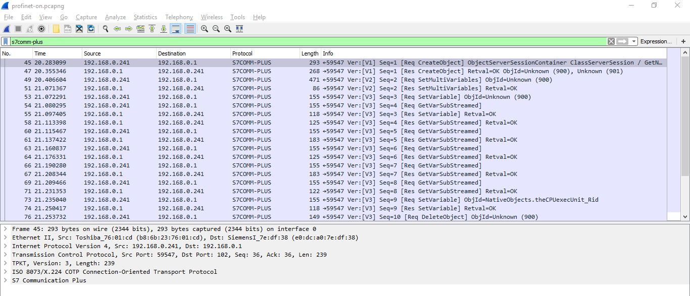

#### Siemens HMI
TIA portal erabiliz siemens-eko HMI programatu:
- https://www.youtube.com/watch?v=_y7Sj6GHsGA
- https://www.youtube.com/watch?v=DLqzIJOi8Z4

rtServer:

https://support.industry.siemens.com/cs/document/109476153/remote-access-to-simatic-hmi-operator-panels?dti=0&lc=en-WW

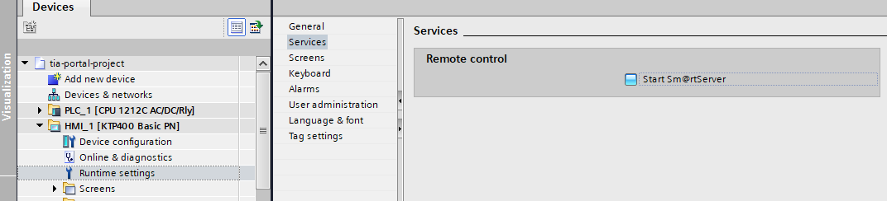

#### NetToPlcSim

S7-PLCSim Siemens-en app bat da PLC bat simulatzeko. Simulatzaile honetara 102 portutik sartu nahi badugu (beste pc batetik adibidez) http://nettoplcsim.sourceforge.net/ erabili behar da.

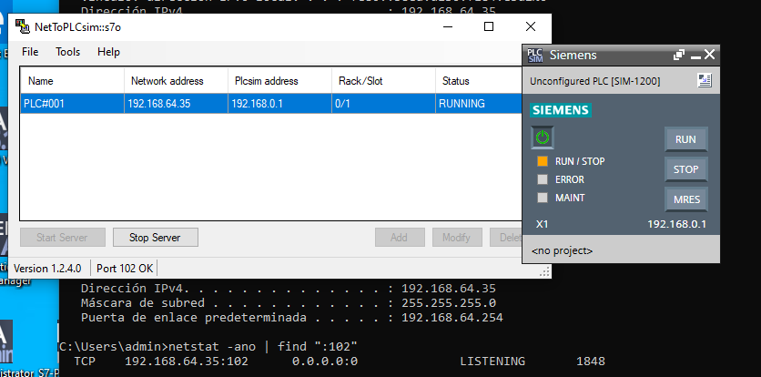

### Node RED. HMI
- https://nodered.org
- https://nodered.org/docs/getting-started/raspberrypi
- https://flows.nodered.org/node/node-red-contrib-modbus
- https://github.com/BiancoRoyal/node-red-contrib-modbus
- https://flows.nodered.org/node/node-red-contrib-openplc
- https://flows.nodered.org/node/node-red-dashboard

- https://flows.nodered.org/node/node-red-contrib-s7comm

- https://nodered.org/docs/user-guide/runtime/securing-node-red

Tutorial batzuk:
- https://www.youtube.com/watch?v=nN9SJfK0iIo
- https://www.youtube.com/watch?v=M0Mjo0J1X_Q, https://www.youtube.com/watch?v=UKv4_jvPtr4 
- https://www.youtube.com/watch?v=FCfmWnxQkoc
- Nodered-S7comm: https://www.youtube.com/watch?v=haV0F-SPGH4
- 

Raspberry pi:
```
## sarea
nano /etc/dhcpcd.conf

## ssh
ssh pi@IP / raspberry

## https://nodered.org/docs/getting-started/raspberrypi

$ bash <(curl -sL https://raw.githubusercontent.com/node-red/linux-installers/master/deb/update-nodejs-and-nodered)
$ sudo systemctl status nodered.service
$ sudo systemctl start nodered.service
$ sudo systemctl enable nodered.service

$ node-red-start

http://[IP]:1880

## modbus
## https://flows.nodered.org/node/node-red-contrib-modbus
$ sudo npm install -g node-red-contrib-modbus --unsafe-perm --build-from-source

## profinet
## https://www.npmjs.com/package/node-red-contrib-s7

http://[IP]:1880 -> node-red menu -> manage pallete -> install 
```

Docker erebiliz node-red:
```
docker run -it -p 1880:1880 --name mynodered nodered/node-red
```

Node red erabiliz datuak jaso/aldatu (tenperatura, ...)

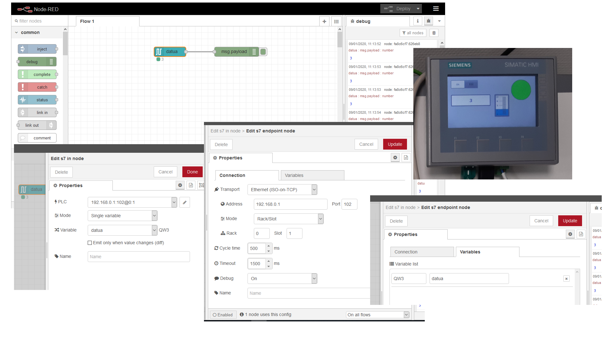

Node-red erabiliz panel bat (SCADA-HMI) sortu:

-https://flows.nodered.org/node/node-red-dashboard

### node s7

- https://www.npmjs.com/package/node-red-contrib-s7
- https://github.com/plcpeople/nodeS7

```
sudo apt install npm
npm install -g n
n stable

npm install nodes7
```

OHARRA: https://flows.nodered.org/node/node-red-contrib-s7comm instalatuta badugu iadanik nodes7 instalatuta edukiko dugu:
```
node
> ...
```

Adibidez:
```
TODO
```

### Factory io
- https://docs.factoryio.com/tutorials/siemens/sample-s7-1200-1500/index.html
- https://docs.factoryio.com/tutorials/siemens/setting-up-s7-1200-1500/index.html

Segurtasuna dela eta ondorengoa aukeratu behar da:


### OPC-UA

- https://www.unified-automation.com/downloads/opc-ua-servers.html
- https://support.industry.siemens.com/tf/WW/en/posts/simatic-net-s7-1200-opc-communication/149421?page=0
- https://opcfoundation.org/products/view/simatic-net-opc-server
- https://www.unified-automation.com/products/development-tools/uaexpert.html
- https://support.industry.siemens.com/tf/WW/en/posts/plcsim-nettoplcsim-simaticnet-opc-connection/103472?page=0
- https://support.industry.siemens.com/cs/document/109771672/firmwareversion-v4-4-released-for-s7-1200?dti=0&lc=en-WW
- https://python-opcua.readthedocs.io/en/latest/index.html
- https://www.youtube.com/watch?v=nXV37QcEjSM
- https://www.youtube.com/watch?v=X4YMdlJnQMo
- https://github.com/FreeOpcUa/freeopcua

### Elastic search. Kibana. 

- https://www.elastic.co/what-is/elk-stack
- https://www.elastic.co/blog/industrial-internet-of-things-iiot-with-the-elastic-stack
- https://www.elastic.co/blog/introducing-machine-learning-for-the-elastic-stack

### Machine learning


### IoT-Cloud MQTT

### ERP

#### odoo
- https://www.odoo.com/
- https://hub.docker.com/_/odoo/

```
docker run -d -e POSTGRES_USER=odoo -e POSTGRES_PASSWORD=odoo -e POSTGRES_DB=postgres --name db postgres:10
ocker run -p 8069:8069 --name odoo --link db:db -t odoo

http://IP:8069
```

## 2. Fasea: Fabrikaren segurtasun azterketa

Lehenengo fasean garatu dugun fabrikaren segurtasuna aztertuko da eta soluzioak inplementatuko dira. ModBUS, SCADA, segmentazioa, TLS, OPC-UA, WIFI, MQTT, ...

### SCADA. ModBUS. Segurtasuna

SCADA eta ModBUS ulertu. Aurreko ariketetan ModBUS trafikoa aztertu eta protokoloaren arkitektura ulertu. Aldatzen saiatu. Segurtasunaren aldetik ondorioak atera.


#### Ariketa

1  - OpenPLC (raspberry pi) botoi-led sistemari ModBUS bezero bat erabiliz LED piztu/itzali:
* ModBUS protokoloa berrikusi. TCP/IP. 502 portua
* ModBUS bezero bat erabiliz konexio bat egin PLCarekin eta wireshark erabiliz 502 portua aztertu
    * https://sourceforge.net/projects/qmodmaster/
    * https://pymodbus.readthedocs.io/en/latest/readme.html

* ModBUS bezeroarekin LED-a piztu/itzali

Foro honetan ModBUS-en %IX sarrerak ezin dira aldatu programaren logikaren kontra. Baina sarrera hau %QX batean jarriz gero bai. horrela kanpotik aldatzeko aukera dago: - https://openplc.discussion.community/post/walk-through-of-hello-world-8461363?&trail=15

>One thing to note is that, if you look at the table, you will see that you can't write to inputs, which mean you can't change the value of the inputs. This is a definition of the Modbus protocol. Therefore, in the hello world example, you won't be able to change the state of the button because it is located in an input area (%IX0.0). To actually control the button, you will have to move it to an output address (can be %QX0.1 for example). This will not have any practical effect in your software besides the fact that you will be able to actually write, or force, the state of the button using Modbus

Gogoratu: 

 > a single-bit physical output is called a coil, and a single-bit physical input is called a discrete input or a contact

* Ondorioak atera

* irudiak

Openplc eta qModmaster     |  Openplc editor
:-------------------------:|:-------------------------:
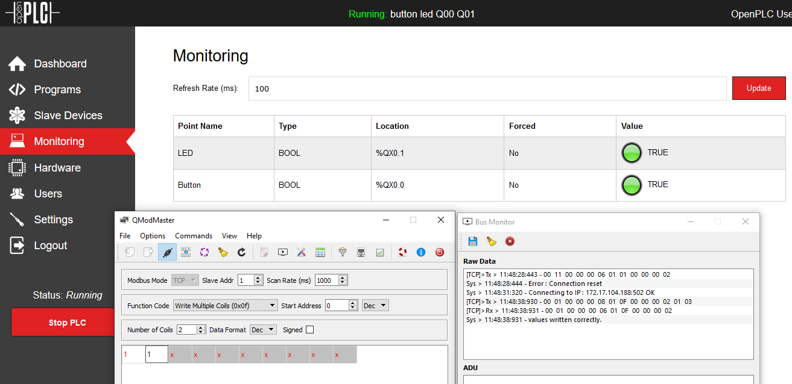  |  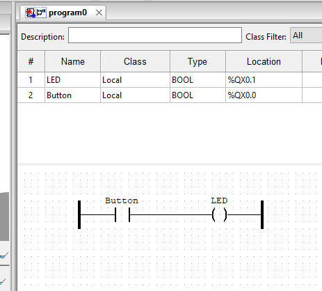

### PLC-en segurtasuna. 

Siemens, PLC simulatuak OpenPLC/raspberry pi (raspberry pi: default user/password: SSH is enabled and the default password for the 'pi' user has not been changed.This is a security risk - please login as the 'pi' user and type 'passwd' to set a new password. /// edo OpenPLC: This means that the first thing you must do after logging in for the first time is change the default username and password!)

### Auditoria

ModBus: ```nmap -sS -T3 --top-ports 3000 167.99.132.140``` begiratu ITS kurtsoa.

nmap maitasunarekin:

```
# https://nmap.org/nsedoc/scripts/modbus-discover.html
nmap -Pn -sT -T2 -n --max-retries 1 --max-hostgroup 1 --max-parallelism 1 --scan-delay 1s -p502 --script modbus-discover

# 
nmap -Pn -sT -T2 -n --max-retries 1 --max-hostgroup 1 --max-parallelism 1 --scan-delay 1s -p102 --script s7-info 
```

kali docker:
```
docker run -t -i kalilinux/kali-rolling /bin/bash
apt update
apt upgrade
apt install metasploit-framework
msfconsole
exit
```
```
docker commit X kali
docker run -t -i kali /bin/bash
```

Raspberry pi + tshark erabiliz OT sareko trafikoa modu pasiboan irakurri eta ondoren python edo elastic-ekin aztertu:

- https://www.elastic.co/blog/analyzing-network-packets-with-wireshark-elasticsearch-and-kibana

Nessus erabiliz:

- https://www.tenable.com/products/industrial-security


## 3. Fasea: Smart Factory

Smart Factory baten proposamena, segurtasuna oinarritzat hartuta fabrika adimendu bat sortzea. Distributed secured factory using Blockchain.

### Access to factory from AWS using ssh tunneling

[[PLC:192.168.0.1:102]<->[102:Factory_1(raspberry):8888]]<-- -->[8888:AWS:102]<-- -->[Client from Internet]

AWS (internal_IP:172.31.28.118, External_IP:3.4.5.6):
```
sudo iptables -t nat -A PREROUTING -p tcp -i eth0 --dport 102 -j DNAT --to-destination 172.31.28.118:8888

sudo vim /etc/ssh/sshd_config
AllowTcpForwarding   yes
GatewayPorts  yes

sudo systemctl restart ssh
```

Factory_1:
```
ssh -N -R 8888:192.168.0.1:102 -v -i key.pem ubuntu@3.4.5.6
edo
ssh -nNT -R 8888:192.168.0.1:102 -v -i key.pem ubuntu@3.4.5.6
```

### Distributed factory using ssh tunneling

[Factory_1]<-- -->[AWS]<-- -->[Factory_N]

TODO:

a) ssh tunneling eginez

b) VPN bat eginez

c) Blockchain

**5G**

5G sarearekin egingo balitz latentzia oso txikia izango luke: Irakurri:

- https://www.raconteur.net/technology/5g-help-manufacturers
- https://www.newequipment.com/industry-trends/article/22060208/5-ways-5g-will-power-the-smart-factory-of-the-future


## 4. HoneyPot

- https://www.incibe-cert.es/blog/guia-implantacion-honeypot-industrial

[incibe-cert_guia_implantacion_honeypot_industrial.pdf](doc/incibe-cert_guia_implantacion_honeypot_industrial.pdf)

- https://github.com/paralax/awesome-honeypots


## Denetatik
- https://www.wireguard.com/
- https://github.com/k4yt3x/wireguard-mesh-configurator
- https://www.linode.com/docs/networking/vpn/set-up-wireguard-vpn-on-ubuntu/
- https://medium.com/@mdp/securing-docker-with-wireguard-82ad45004f4d
**[erabili wireguard openvpn beharrean]**
- https://hackernoon.com/using-a-vpn-server-to-connect-to-your-aws-vpc-for-just-the-cost-of-an-ec2-nano-instance-3c81269c71c2
- https://github.com/OpenVPN/openvpn
- https://wiki.mikrotik.com/wiki/OpenVPN
- https://www.inesem.es/articulos-investigacion/almacen-automatizado-paletizacion-cajas-transelevador

## RDP

```
VBoxManage startvm "windows10-TIA-Portal" --type headless

sudo apt-get install remmina remmina-plugin-vnc remmina-plugin-rdp
```

remmina->RDP: color depth:16bpp jarri eta gero 'localhost'

## VirtualBox

[Internet/LAN]<--->[WAN:pfsense:OT_LAN(192.168.1.0/24)]<---[Tia-Portal]----[PLCSim(192.168.1.10)]
